## 🚀 Engineering Portfolio

<picture>
  <source media="(prefers-color-scheme: dark)" srcset="./dark.svg">
  <source media="(prefers-color-scheme: light)" srcset="./light.svg">
  
</picture>

## 💫 About Me

Engineering student with a strong interest in cybersecurity, systems engineering, and technology-driven problem solving. I enjoy exploring how systems work at a deeper level — analyzing networks, studying potential vulnerabilities, and building practical tools that improve security and efficiency. My focus is on learning both the defensive and analytical aspects of cybersecurity while developing skills in Linux environments, scripting, and automation. I use GitHub to document projects, experiments, and technical learning as I continue to grow as an engineer.

## 🛠️ Tech Stack

### Languages

### Systems & Tools

### Web Technologies

### Databases

### Security & Networking

## 📊 GitHub Analytics

### 📈 Contribution Graph

## 🐍 Contribution Snake

---

  

  *Crafted with 🔧 for the love of cybersecurity*

