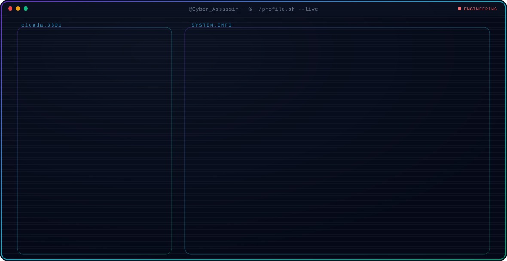

## 🚀 Engineering Portfolio

<picture>
  <source media="(prefers-color-scheme: dark)" srcset="./dark.svg">
  
</picture>

## 💫 About Me

Engineering student with a strong interest in cybersecurity, systems engineering, and technology-driven problem solving. I enjoy exploring how systems work at a deeper level — analyzing networks, studying potential vulnerabilities, and building practical tools that improve security and efficiency. My focus is on learning both the defensive and analytical aspects of cybersecurity while developing skills in Linux environments, scripting, and automation. I use GitHub to document projects, experiments, and technical learning as I continue to grow as an engineer.

Currently an **Intern at Reinfosec**. Recent work includes **Echo-Pi** (offline satellite), **ISRO2026** (air-gapped system for MPLS systems), **SENTINEL** (cyber-security suite), **Ultron IoT** (Blackhat 2027 IoT submission), **VeriPass** (blockchain-based ecosystem), **CyberPixel** (story cybersecurity game in Minecraft), and **ULTRON S3** (complete cybersecurity suite).

## 🛡️ Security

See More

 

## 🧠 Skills

See More

 

## ⚙️ Tech

See More

 

## 🎯 Working On

## 💻 I Use

See More

 

## 🚀 Projects

| Project | Description |
| :-- | :-- |
| **Echo-Pi** | Offline satellite |
| **ISRO2026** | Air-gapped system for MPLS systems |
| **SENTINEL** | Cyber-Security suite |
| **Ultron (IoT)** | Blackhat 2027 IoT submission |
| **VeriPass** | Blockchain-based ecosystem |
| **CyberPixel** | Story cybersecurity game in Minecraft |
| **ULTRON (S3)** | Complete CyberSecurity Suite |

## 📊 Stats

## 🐍 Contribution Snake

<picture>
  <source media="(prefers-color-scheme: dark)" srcset="https://raw.githubusercontent.com/ADITYA02NM/ADITYA02NM/output/github-contribution-grid-snake-dark.svg">
  
</picture>

## 🫱🏼‍🫲🏼 Connect with me

---

*Crafted with 🔧 for the love of cybersecurity*
